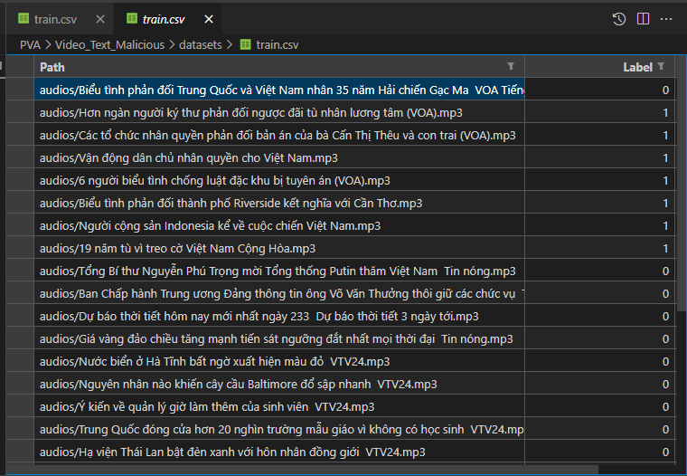

# Text Malicious Detection

Sử dụng để phát hiện nội dung phản động

Code đã được viết theo định dạng của: [URL_Phising](https://github.com/hoangtrongbinh1111/URL_Phising/tree/main)
### Yêu cầu

* Python 3.8+

### Cài đặt

* Thực hiện câu lệnh:

    `$ pip install -r requirements.txt` 

* Clone mô hình ASR:

    `$ cd modelDir/asr_models` 

    `$ git lfs install` 
    
    `$ git clone https://huggingface.co/vinai/PhoWhisper-medium` 

### Chuẩn bị dữ liệu

* Dữ liệu huấn luyện được tổ chức như sau:
    * Folder "**audios**": chứa các file audio của bộ dữ liệu được lưu dưới dạng file "**\*.mp3**"
    * 2 File "**train.csv**", "**test.csv**": được bao gồm các thông tin "**path**": đường dẫn tới file audio trong tập huấn luyện, "**label**": nhãn của audio đấy

